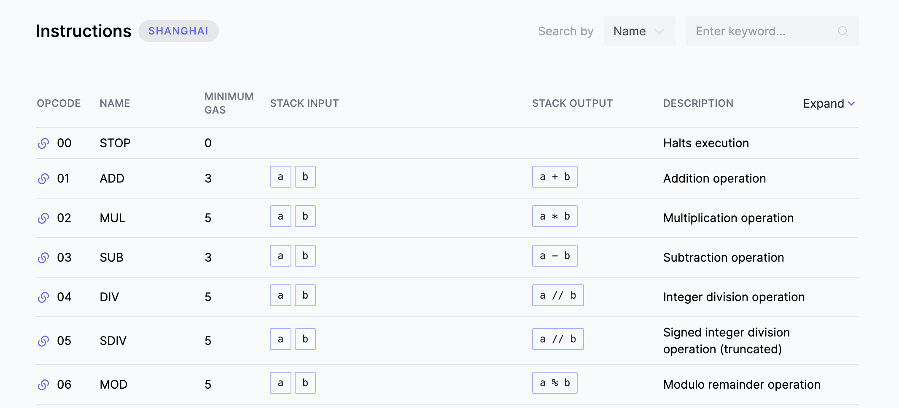
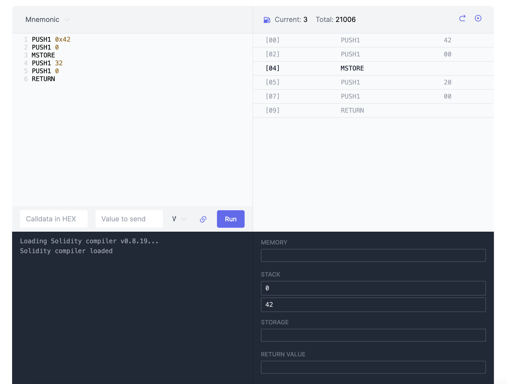
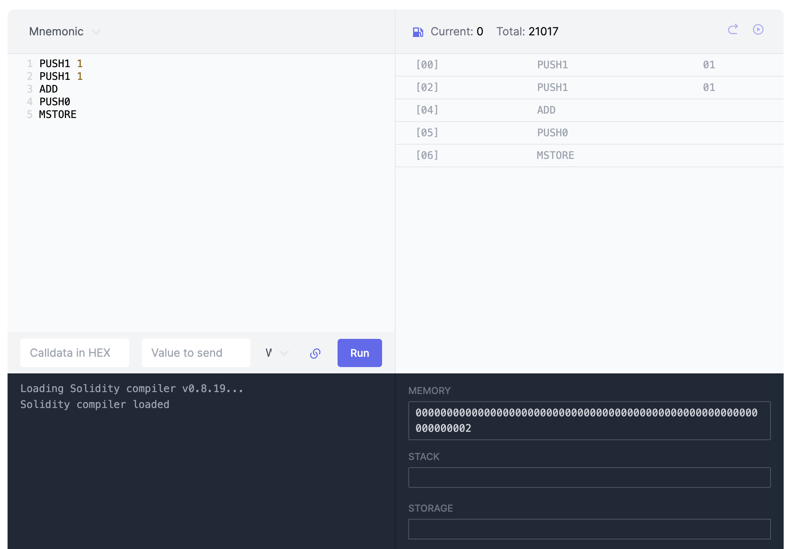

# WTF Opcodes极简入门: 2. Opcodes分类

我最近在重新学以太坊opcodes，也写一个“WTF EVM Opcodes极简入门”，供小白们使用。

推特：[@0xAA_Science](https://twitter.com/0xAA_Science)

社区：[Discord](https://discord.gg/5akcruXrsk)｜[微信群](https://docs.google.com/forms/d/e/1FAIpQLSe4KGT8Sh6sJ7hedQRuIYirOoZK_85miz3dw7vA1-YjodgJ-A/viewform?usp=sf_link)｜[官网 wtf.academy](https://wtf.academy)

所有代码和教程开源在github: [github.com/WTFAcademy/WTF-Opcodes](https://github.com/WTFAcademy/WTF-Opcodes)

-----

这一讲，我们将介绍Opcodes的分类，对Opcodes进行分类，并使用这些操作码来创建一个简单的程序，执行`1+1`的计算。

## Opcodes分类

Opcodes可以根据功能分为以下几类:

- **堆栈（Stack）指令**: 这些指令直接操作EVM堆栈。这包括将元素压入堆栈（如`PUSH1`）和从堆栈中弹出元素（如`POP`）。

- **算术（Arithmetic）指令**: 这些指令用于在EVM中执行基本的数学运算，如加法（`ADD`）、减法（`SUB`）、乘法（`MUL`）和除法（`DIV`）。

- **比较（Comparison）指令**: 这些指令用于比较堆栈顶部的两个元素。例如，大于（`GT`）和小于（`LT`）。

- **位运算（Bitwise）指令**: 这些指令用于在位级别上操作数据。例如，按位与（`AND`）和按位或（`OR`）。

- **内存（Memory）指令**: 这些指令用于操作EVM的内存。例如，将内存中的数据读取到堆栈（`MLOAD`）和将堆栈中的数据存储到内存（`MSTORE`）。

- **存储（Storage）指令**: 这些指令用于操作EVM的账户存储。例如，将存储中的数据读取到堆栈（`SLOAD`）和将堆栈中的数据保存到存储（`SSTORE`）。这类指令的gas消耗比内存指令要大。

- **控制流（Control Flow）指令**: 这些指令用于EVM的控制流操作，比如跳转`JUMP`和跳转目标`JUMPDEST`。

- **上下文（Context）指令**: 这些指令用于获取交易和区块的上下文信息。例如，获取msg.sender（`CALLER`）和当前可用的gas（`GAS`）。

## evm.codes

我们在WTF-Opcodes教程的入门部分会使用[evm.codes](https://www.evm.codes/?fork=shanghai)来运行Opcodes程序。

### 1. Opcode列表

evm.codes提供了完整的Opcodes列表，这对于学习Opcodes非常有用。它包括每个Opcode的编号（例如，`ADD`的编号是`0x01`）、名称、gas消耗、堆栈输入和输出以及一个简短的描述。



### 2. Playground

evm.codes还提供了一个在线的Opcodes[playground](https://www.evm.codes/playground)，你可以在这里运行Opcodes代码。Playground分为三部分：左上角的编辑器，右上角的执行界面，以及右下角的状态界面，它们分别显示你的代码、代码的执行过程和执行结果。





## 示例： 1+1

我们现在来用Opcodes编写一个简单的程序，这个程序将在堆栈中计算1+1，并将结果保存到内存中。代码如下：

```go
PUSH1 0x01
PUSH1 0x01
ADD
PUSH0
MSTORE
```

我们来逐行分析这个程序，同时展示每行指令执行后堆栈和内存的状态：

1. 第1-2行：`PUSH1`指令将一个长度为1字节的数据压入堆栈顶部。

    ```go
    PUSH1 0x01
    // stack: [1]
    PUSH1 0x01
    // stack: [1, 1]
    ```

2. 第3行：`ADD`指令会弹出堆栈顶部的两个元素，计算它们的和，然后将结果压入堆栈。

    ```go
    ADD
    // stack: [2]
    ```

3. 第4行: `PUSH0`指令将0压入堆栈。

    ```go
    PUSH0
    // stack: [0, 2]
    ```

4. 第5行: `MSTORE` 属于内存指令，它会弹出堆栈顶的两个数据 `[offset, value]`（偏移量和值），然后将`value`（长度为32字节）保存到内存索引（偏移量）为`offset`的位置。

    ```go
    MSTORE
    // stack: []
    // memory: [0: 2]
    ```

你可以在evm.codes中验证执行过程和结果。



## 总结

这一讲，我们介绍了Opcodes的功能分类，并使用opcodes写了第一个程序，计算`1+1`。接下来，我们会按分类介绍所有的opcodes。