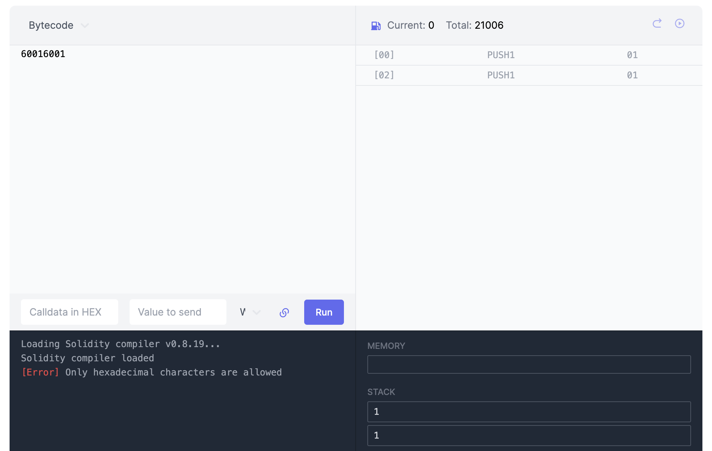
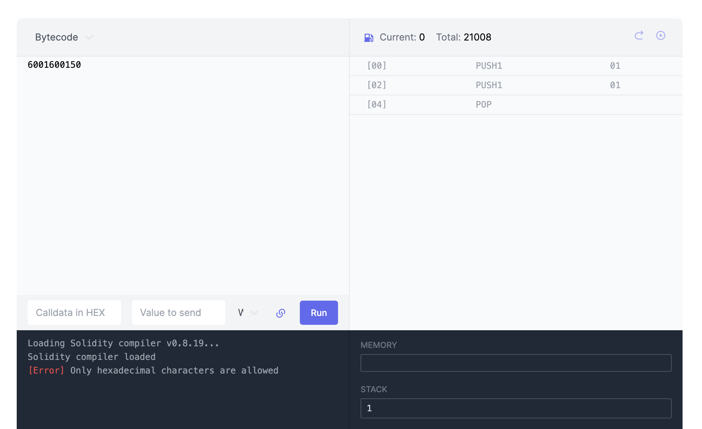

# WTF Opcodes极简入门: 3. 堆栈指令

我最近在重新学以太坊opcodes，也写一个“WTF EVM Opcodes极简入门”，供小白们使用。

推特：[@0xAA_Science](https://twitter.com/0xAA_Science)

社区：[Discord](https://discord.gg/5akcruXrsk)｜[微信群](https://docs.google.com/forms/d/e/1FAIpQLSe4KGT8Sh6sJ7hedQRuIYirOoZK_85miz3dw7vA1-YjodgJ-A/viewform?usp=sf_link)｜[官网 wtf.academy](https://wtf.academy)

所有代码和教程开源在github: [github.com/WTFAcademy/WTF-Opcodes](https://github.com/WTFAcademy/WTF-Opcodes)

-----

这一讲，我们介绍EVM中的程序计数器（Program Counter）和堆栈指令，同时用Python实现一个简化版的EVM，可以执行`PUSH`和`POP`指令。

## 程序计数器

在EVM中，程序计数器（通常缩写为 PC）是一个用于跟踪当前执行指令位置的寄存器。每执行一条指令（opcode），程序计数器的值会自动增加，以指向下一个待执行的指令。但是，这个过程并不总是线性的，在执行跳转指令（`JUMP`和`JUMPI`）时，程序计数器会被设置为新的值。

下面我们使用Python创建一个简单的EVM程序计数器：

```python
class EVM:
    # 初始化
    def __init__(self, code):
        self.code = code # 初始化字节码，bytes对象
        self.pc = 0  # 初始化程序计数器为0
        self.stack = [] # 堆栈初始为空

    # 获取当前指令
    def next_instruction(self):
        op = self.code[self.pc]  # 获取当前指令
        self.pc += 1  # 递增
        return op

    def run(self):
        while self.pc < len(self.code):
            op = self.next_instruction() # 获取当前指令
```

上面的示例代码很简单，它的功能就是利用程序计数器遍历字节码中的opcode，在接下来的部分，我们将为它添加更多的功能。

```python
code = b"\x01\x02\x03"
evm = EVM(code)
evm.run()
```

## 堆栈指令

EVM是基于堆栈的，堆栈遵循 LIFO（后入先出）原则，最后一个被放入堆栈的元素将是第一个被取出的元素。PUSH和POP指令就是用来操作堆栈的。

### PUSH

在EVM中，PUSH是一系列操作符，共有32个（在以太坊上海升级前），从`PUSH1`，`PUSH2`，一直到`PUSH32`，操作码范围为`0x60`到`0x7F`。它们将一个字节大小为1到32字节的值从字节码压入堆栈（堆栈中每个元素的长度为32字节），每种指令的gas消耗都是3。

以`PUSH1`为例，它的操作码为`0x60`，它会将字节码中的下一个字节压入堆栈。例如，字节码`0x6001`就表示把`0x01`压入堆栈。`PUSH2`就是将字节码中的下两个字节压入堆栈，例如，`0x610101`就是把`0x0101`压入堆栈。其他的PUSH指令类似。

以太坊上海升级新加入了`PUSH0`，操作码为`0x5F`（即`0x60`的前一位），用于将`0`压入堆栈，gas消耗为2，比其他的PUSH指令更省gas。

下面我们用python实现`PUSH0`到`PUSH32`，主要逻辑见`push()`和`run()`函数:

```python
PUSH0 = 0x5F
PUSH1 = 0x60
PUSH32 = 0x7F

class EVM:
    def __init__(self, code):
        self.code = code # 初始化字节码，bytes对象
        self.pc = 0  # 初始化程序计数器为0
        self.stack = [] # 堆栈初始为空

    def next_instruction(self):
        op = self.code[self.pc]  # 获取当前指令
        self.pc += 1  # 递增
        return op

    def push(self, size):
        data = self.code[self.pc:self.pc + size] # 按照size从code中获取数据
        value = int.from_bytes(data, 'big') # 将bytes转换为int
        self.stack.append(value) # 压入堆栈
        self.pc += size # pc增加size单位

    def run(self):
        while self.pc < len(self.code):
            op = self.next_instruction()

            if PUSH1 <= op <= PUSH32:
                size = op - PUSH1 + 1
                self.push(size)
            elif op == PUSH0:
                self.stack.append(0)
```

字节码`0x60016001`（PUSH1 1 PUSH1 1）会将两个1压入堆栈，下面我们执行一下：

```python
code = b"\x60\x01\x60\x01"
evm = EVM(code)
evm.run()
print(evm.stack)
# output: [1, 1]
```

你也可以在evm.codes上验证（注意要把字节码开头的`0x`去掉）：



### POP

在EVM中，`POP`指令（操作码`0x50`，gas消耗`2`）用于移除栈顶元素；如果当前堆栈为空，就抛出一个异常。

下面我们将`POP`指令加入到之前的代码中，主要逻辑见`pop()`和`run()`函数:

```python
PUSH0 = 0x5F
PUSH1 = 0x60
PUSH32 = 0x7F
POP = 0x50

class EVM:
    def __init__(self, code):
        self.code = code # 初始化字节码，bytes对象
        self.pc = 0  # 初始化程序计数器为0
        self.stack = [] # 堆栈初始为空

    def next_instruction(self):
        op = self.code[self.pc]  # 获取当前指令
        self.pc += 1  # 递增
        return op

    def push(self, size):
        data = self.code[self.pc:self.pc + size] # 按照size从code中获取数据
        value = int.from_bytes(data, 'big') # 将bytes转换为int
        self.stack.append(value) # 压入堆栈
        self.pc += size # pc增加size单位

    def pop(self):
        if len(self.stack) == 0:
            raise Exception('Stack underflow')
        return self.stack.pop() # 弹出堆栈

    def run(self):
        while self.pc < len(self.code):
            op = self.next_instruction()

            if PUSH1 <= op <= PUSH32: # 如果为PUSH1-PUSH32
                size = op - PUSH1 + 1
                self.push(size)
            elif op == PUSH0: # 如果为PUSH0
                self.stack.append(0)
                self.pc += size
            elif op == POP: # 如果为POP
                self.pop()
```

字节码`0x6001600150`（PUSH1 1 PUSH1 1 POP）会将两个1压入堆栈，然后再弹出一个1。下面我们执行一下：

```python
code = b"\x60\x01\x60\x01\x50"
evm = EVM(code)
evm.run()
evm.stack
# output: [1]
```

你也可以在evm.codes上验证（注意要把字节码开头的`0x`去掉）：



## 总结

这一讲，我们主要介绍了EVM中的程序计数器和堆栈指令，特别是`PUSH`和`POP`指令。并且参考[evm-from-scratch](https://github.com/w1nt3r-eth/evm-from-scratch)，我们使用Python实现了一个简化版的EVM，能够处理`PUSH`和`POP`指令。在后续的教程中，我们将继续探索更多的opcodes，从而进一步完善我们的EVM实现。