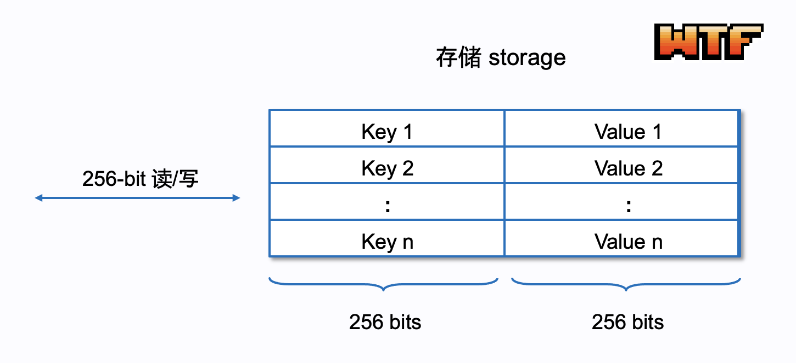

# WTF Opcodes极简入门: 8. 存储指令

我最近在重新学以太坊opcodes，也写一个“WTF EVM Opcodes极简入门”，供小白们使用。

推特：[@0xAA_Science](https://twitter.com/0xAA_Science)

社区：[Discord](https://discord.gg/5akcruXrsk)｜[微信群](https://docs.google.com/forms/d/e/1FAIpQLSe4KGT8Sh6sJ7hedQRuIYirOoZK_85miz3dw7vA1-YjodgJ-A/viewform?usp=sf_link)｜[官网 wtf.academy](https://wtf.academy)

所有代码和教程开源在github: [github.com/WTFAcademy/WTF-Opcodes](https://github.com/WTFAcademy/WTF-Opcodes)

-----

在这一讲，我们将介绍EVM中用于存储（Storage）操作的2个指令：`SSTORE`和`SLOAD`。并且，我们将在用Python写的极简版EVM中添加对这些操作的支持。

## EVM中的存储

我们在[第一讲](https://github.com/WTFAcademy/WTF-Opcodes/blob/main/01_HelloOpcodes/readme.md)介绍了EVM的存储，和内存不同，它是一种持久化存储空间，存在存储中的数据在交易之间可以保持。它是EVM的状态存储的一部分，支持以256 bit为单位的读写。



由于存储使用键值对存储数据，每个键和值都是256 bit，因此我们可以用Python内置的`dict`（字典）来代表存储：

```python
def __init__(self, code):
    self.code = code
    self.pc = 0
    self.stack = []
    self.memory = bytearray()  # 内存初始化为空
    self.storage = {}  # 存储初始化为空字典
```

对存储的读取（`SLOAD`）和写入（`SSTORE`）都需要gas，并且比内存操作更昂贵。这样设计可以防止滥用存储资源，因为所有的存储数据都需要在每个以太坊节点上保存。

## SSTORE (存储写)

`SSTORE`指令用于将一个256位（32字节）的值写入到存储。它从堆栈中弹出两个元素，第一个元素为存储的地址（key），第二个元素为存储的值（value）。操作码是`0x55`，gas消耗根据实际改变的数据计算（下面给出）。

```python
def sstore(self):
    if len(self.stack) < 2:
        raise Exception('Stack underflow')
    key = self.stack.pop()
    value = self.stack.pop()
    self.storage[key] = value
```

我们在`run()`函数中添加对`SSTORE`指令的处理：

```python
def run(self):
    while self.pc < len(self.code):
        op = self.next_instruction()

        # ... 其他指令的处理 ...

        elif op == SSTORE: # 处理SSTORE指令
            self.sstore()
```

现在，我们可以尝试运行一个包含`SSTORE`指令的字节码：`0x6002600055`（PUSH1 2 PUSH1 0 SSTORE）。这个字节码将`2`和`0`推入堆栈，然后进行`SSTORE`，将`2`存到键为`0x0`的存储槽。

```python
# SSTORE
code = b"\x60\x02\x60\x00\x55"
evm = EVM(code)
evm.run()
print(evm.storage)  
# Output: {0: 2}
```

## SLOAD (存储读)

`SLOAD`指令从存储中读取一个256位（32字节）的值并推入堆栈。它从堆栈中弹出一个元素，从该元素表示的存储槽中加载值，并将其推入堆栈。操作码是`0x54`，gas消耗后面给出。

```python
def sload(self):
    if len(self.stack) < 1:
        raise Exception('Stack underflow')
    key = self.stack.pop()
    value = self.storage.get(key, 0) # 如果键不存在，返回0
    self.stack.append(value)
```

我们在`run()`函数中添加对`SLOAD`指令的处理：

```python
elif op == SLOAD: 
    self.sload()
```

现在，我们可以尝试运行一个包含`SLOAD`指令的字节码：`0x6002600055600054`（PUSH1 2 PUSH1 0 SSTORE PUSH1 0 SLOAD）。这个字节码将`2`和`0`推入堆栈，然后进行`SSTORE`，将`2`存到键为`0`的地方；然后将`0`推入堆栈，然后进行`SLOAD`，将刚才写入`0x0`存储槽的值读取出来。

```python
# SLOAD
code = b"\x60\x02\x60\x00\x55\x60\x00\x54"
evm = EVM(code)
evm.run()
print(evm.storage)  
# 输出: {0: 2}
print(evm.stack)  
# 输出: [2]
```

## 访问集 EIP-2929

访问集（Access Sets）是[EIP-2929](https://eips.ethereum.org/EIPS/eip-2929)提出的一种新概念，它的引入有助于优化Gas计费和以太坊的网络性能。访问集是在每个外部交易中定义的，并且在交易过程中会跟踪和记录每个交易访问过的合约地址和存储槽（slot）。

- 合约地址：在执行交易过程中，任何被访问到的地址都会被添加到访问集中。
- 存储槽：这个列表包含了一个交易在执行过程中访问过的所有存储槽。

如果一个地址或存储槽在访问集中，我们称它为"warm"，否则称之为"cold"。一个地址或存储槽在一次交易中首次被访问时，它会从"cold"变为"warm"。在交易执行期间，如果一个指令需要访问一个"cold"的地址或存储槽，那么这个指令的Gas消耗会更高。而对 "warm" 的地址或存储槽的访问，则会有较低的 Gas 消耗，因为相关数据已经被缓存了。

### Gas Cost

对于`SLOAD`（存储读），如果读取的存储槽为"cold"（即这是交易中首次访问），那么`SLOAD`的gas消耗为2100 gas；如果为 "warm"（即在交易中已经访问过），那么`SLOAD`的gas消耗为100 gas。

对于`SSTORE`（存储写），gas计算公式更为复杂，分为gas消耗和gas返还两部分。

1. `SSTORE`的gas消耗：简单来说，如果存储槽为`cold`，则需要多花2100 gas；如果存储槽初始值为0，那么将它改为非0值的gas消耗最大，为22100 gas。

    具体计算公式如下：

    ```python
    static_gas = 0

    if value == current_value
        base_dynamic_gas = 100
    else if current_value == original_value
        if original_value == 0
            base_dynamic_gas = 20000
        else
            base_dynamic_gas = 2900
    else
        base_dynamic_gas = 100

    if key is not warm
        base_dynamic_gas += 2100
    ```

    其中`value`为要存储的新值，`current_value`为存储槽当前值，`original_value`为交易开始时存储槽的原始值，`base_dynamic_gas`为gas消耗。

2. `SSTORE`的gas返还：当要存储的新值不等于存储槽的当前值时，可能触发gas返还。简单来说，将存储槽的非0值改为0，返还的gas最多高达 19900 gas。

    ```python
    if value != current_value
        if current_value == original_value
            if original_value != 0 and value == 0
                gas_refunds += 4800
        else
            if original_value != 0
                if current_value == 0
                    gas_refunds -= 4800
                else if value == 0
                    gas_refunds += 4800
            if value == original_value
                if original_value == 0
                        gas_refunds += 19900
                else
                    if key is warm
                        gas_refunds += 5000 - 2100 - 100
                    else
                        gas_refunds += 4900
    ```

    其中`value`为要存储的新值，`current_value`为存储槽当前值，`original_value`为交易开始时存储槽的原始值，`gas_refunds`为gas返还。

## 总结

这一讲，我们介绍了EVM中的存储操作指令（`SSTORE`和`SLOAD`），并在极简版EVM中添加了对它们的支持。这些操作允许我们在EVM的存储中写入和读取值，为更复杂的合约逻辑提供基础。

课后习题: 写出`0x6002602055602054`对应的指令形式，并给出运行后的堆栈和存储的状态。
