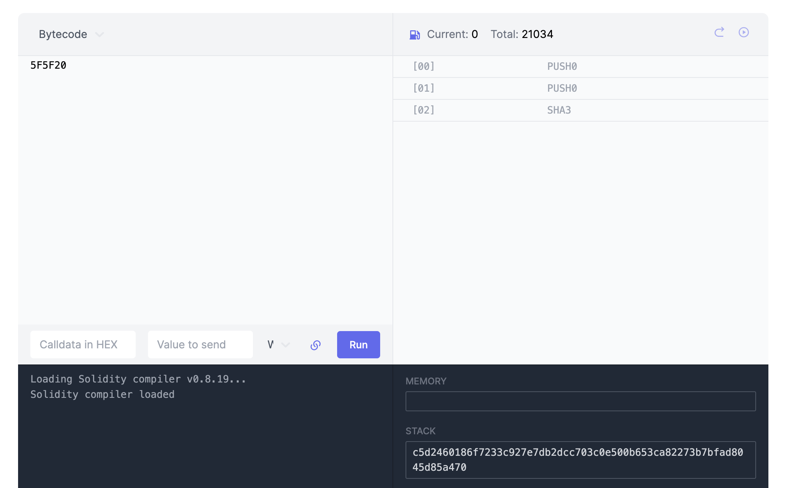

# WTF Opcodes极简入门: 12. SHA3指令

我最近在重新学以太坊opcodes，也写一个“WTF EVM Opcodes极简入门”，供小白们使用。

推特：[@0xAA_Science](https://twitter.com/0xAA_Science)

社区：[Discord](https://discord.gg/5akcruXrsk)｜[微信群](https://docs.google.com/forms/d/e/1FAIpQLSe4KGT8Sh6sJ7hedQRuIYirOoZK_85miz3dw7vA1-YjodgJ-A/viewform?usp=sf_link)｜[官网 wtf.academy](https://wtf.academy)

所有代码和教程开源在github: [github.com/WTFAcademy/WTF-Opcodes](https://github.com/WTFAcademy/WTF-Opcodes)

-----

这一讲，我们将介绍EVM唯一内置的密码学指令--`SHA3`，你可以用它计算`keccak-256`哈希。

## SHA3指令

在EVM中，计算数据的哈希是一个常见的[操作](https://github.com/AmazingAng/WTF-Solidity/tree/main/28_Hash)。以太坊使用Keccak算法（[SHA-3](https://en.wikipedia.org/wiki/SHA-3)）计算数据的哈希，并提供了一个专门的操作码`SHA3`，Solidity中的`keccak256()`函数就是建立在它之上的。

`SHA3(offset, size)`指令从堆栈中取出两个参数，起始位置`offset`和长度`size`（以字节为单位），然后它从内存中读取起始位置`offset`开始的`size`长度的数据，计算这段数据的Keccak-256哈希，并将结果（一个32字节的值）压入堆栈。它的操作码为`0x20`，gas消耗为`30 + 6*数据的字节长度 + 扩展内存成本`。

在Python中，我们可以使用`pysha3`库来实现`keccak-256`哈希计算。首先你需要安装这个库：

```bash
pip install pysha3
```

下面，让我们在极简EVM中支持SHA3指令：

```python
import sha3

SHA3 = 0x20

def sha3(self):
    if len(self.stack) < 2:
        raise Exception('Stack underflow')
    
    offset = self.pop()
    size = self.pop()
    data = self.memory[offset:offset+size]  # 从内存中获取数据
    hash_value = int.from_bytes(sha3.keccak_256(data).digest(), 'big')  # 计算哈希值
    self.stack.append(hash_value)  # 将哈希值压入堆栈

def run(self):
    while self.pc < len(self.code):
        op = self.next_instruction()

        # ... 其他指令的实现 ...

            elif op == SHA3: # 如果为SHA3
                self.sha3()
```

我们可以尝试运行一个包含`SHA3`指令的字节码：`0x5F5F20`（PUSH0 PUSH0 SHA3）。这个字节码将两个`0`推入堆栈，然后使用`SHA3`指令计算`0`的哈希。

```python
# SHA3
code = b"\x5F\x5F\x20"
evm = EVM(code)
evm.run()
print(hex(evm.stack[-1]))  # 打印出0的keccak256 hash
# output: 0xc5d2460186f7233c927e7db2dcc703c0e500b653ca82273b7bfad8045d85a470
```

我们可以在evm.codes上验证结果：



## 总结

这一讲，我们介绍了EVM中重要的操作符`SHA3`，它为我们提供了计算数据哈希的功能，这在验证数据或身份时非常重要。目前，我们写的极简EVM已经支持了112/144个操作码，剩下的不多了！