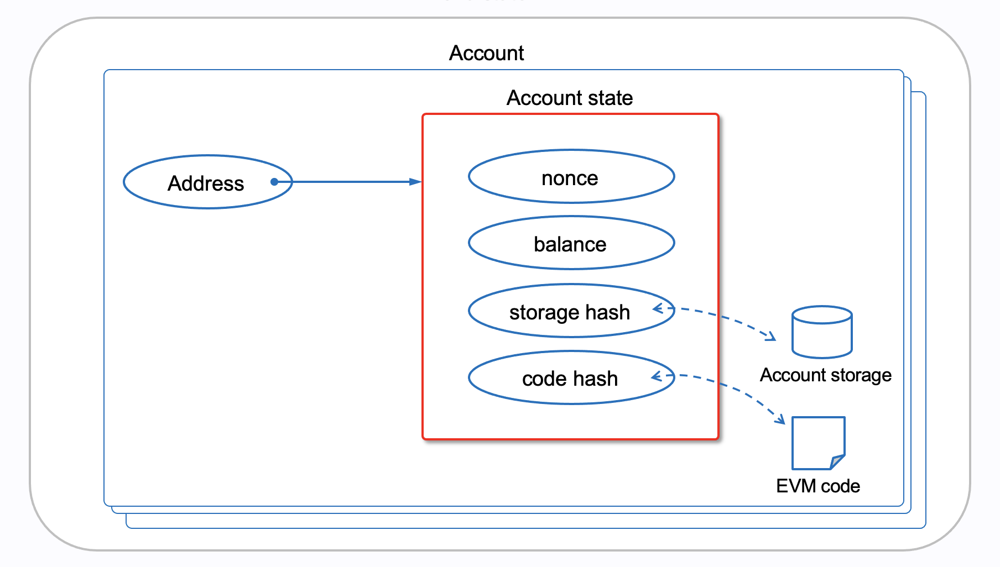

# WTF Opcodes极简入门: 13. 账户指令

我最近在重新学以太坊opcodes，也写一个“WTF EVM Opcodes极简入门”，供小白们使用。

推特：[@0xAA_Science](https://twitter.com/0xAA_Science)

社区：[Discord](https://discord.gg/5akcruXrsk)｜[微信群](https://docs.google.com/forms/d/e/1FAIpQLSe4KGT8Sh6sJ7hedQRuIYirOoZK_85miz3dw7vA1-YjodgJ-A/viewform?usp=sf_link)｜[官网 wtf.academy](https://wtf.academy)

所有代码和教程开源在github: [github.com/WTFAcademy/WTF-Opcodes](https://github.com/WTFAcademy/WTF-Opcodes)

-----

在这一讲，我们将探索EVM中与账户（Account）相关的4个指令，包括`BALANCE`, `EXTCODESIZE`, `EXTCODECOPY`, 以及 `EXTCODEHASH`。我们能利用这些指令获取以太坊账户的信息。

## 以太坊账户结构

以太坊上的账户分两类：外部账户（Externally Owned Accounts，EOA）和合约账户。EOA是用户在以太坊网络上的代表，它们可以拥有ETH、发送交易并与合约互动；而合约账户是存储和执行智能合约代码的实体，它们也可以拥有和发送ETH，但不能主动发起交易。



以太坊上的账户结构非常简单，你可以它理解为地址到账户状态的映射。账户地址是20字节（160位）的数据，可以用40位的16进制表示，比如`0x9bbfed6889322e016e0a02ee459d306fc19545d8`。而账户的状态具有4种属性：

- **Balance**：这是账户持有的ETH数量，用Wei表示（1 ETH = 10^18 Wei）。
  
- **Nonce**：对于外部账户（EOA），这是该账户发送的交易数。对于合约账户，它是该账户创建的合约数量。
  
- **Storage**：每个合约账户都有与之关联的存储空间，其中包含状态变量的值。
  
- **Code**：合约账户的字节码。

也就是说，只有合约账户拥有`Storage`和`Code`，EOA没有。

为了让极简EVM支持账户相关的指令，我们利用`dict`做一个简单账户数据库：

```python
account_db = {
    '0x9bbfed6889322e016e0a02ee459d306fc19545d8': {
        'balance': 100, # wei
        'nonce': 1, 
        'storage': {},
        'code': b'\x60\x00\x60\x00'  # Sample bytecode (PUSH1 0x00 PUSH1 0x00)
    },
    # ... 其他账户数据 ...
}
```

下面，我们将介绍账户相关指令。

## BALANCE

`BALANCE` 指令用于返回某个账户的余额。它从堆栈中弹出一个地址，然后查询该地址的余额并压入堆栈。它的操作码是`0x31`，gas为2600（cold address）或100（warm address）。

```python
def balance(self):
    if len(self.stack) < 1:
        raise Exception('Stack underflow')
    addr_int = self.stack.pop()
    # 将stack中的int转换为bytes，然后再转换为十六进制字符串，用于在账户数据库中查询
    addr_str = '0x' + addr_int.to_bytes(20, byteorder='big').hex()
    self.stack.append(account_db.get(addr_str, {}).get('balance', 0))
```

我们可以尝试运行一个包含`BALANCE`指令的字节码：`739bbfed6889322e016e0a02ee459d306fc19545d831`（PUSH20 9bbfed6889322e016e0a02ee459d306fc19545d8 BALANCE）。这个字节码使用`PUSH20`将一个地址推入堆栈，然后使用`BALANCE`指令查询该地址的余额。

```python
# BALANCE
code = b"\x73\x9b\xbf\xed\x68\x89\x32\x2e\x01\x6e\x0a\x02\xee\x45\x9d\x30\x6f\xc1\x95\x45\xd8\x31"
evm = EVM(code)
evm.run()
print(evm.stack)
# output: 100
```

## EXTCODESIZE

`EXTCODESIZE` 指令用于返回某个账户的代码长度（以字节为单位）。它从堆栈中弹出一个地址，然后查询该地址的代码长度并压入堆栈。如果账户不存在或没有代码，返回0。他的操作码为`0x3B`，gas为2600（cold address）或100（warm address）。

```python
def extcodesize(self):
    if len(self.stack) < 1:
        raise Exception('Stack underflow')
    addr_int = self.stack.pop()
    # 将stack中的int转换为bytes，然后再转换为十六进制字符串，用于在账户数据库中查询
    addr_str = '0x' + addr_int.to_bytes(20, byteorder='big').hex()
    self.stack.append(len(account_db.get(addr_str, {}).get('code', b'')))
```

我们可以尝试运行一个包含`EXTCODESIZE`指令的字节码：`739bbfed6889322e016e0a02ee459d306fc19545d83B`（PUSH20 9bbfed6889322e016e0a02ee459d306fc19545d8 EXTCODESIZE）。这个字节码使用`PUSH20`将一个地址推入堆栈，然后使用`EXTCODESIZE`指令查询该地址的代码长度。

```python
# EXTCODESIZE
code = b"\x73\x9b\xbf\xed\x68\x89\x32\x2e\x01\x6e\x0a\x02\xee\x45\x9d\x30\x6f\xc1\x95\x45\xd8\x3B"
evm = EVM(code)
evm.run()
print(evm.stack)
# output: 4
```

## EXTCODECOPY

`EXTCODECOPY` 指令用于将某个账户的部分代码复制到EVM的内存中。它会从堆栈中弹出4个参数(addr, mem_offset, code_offset, length)，分别对应要查询的地址，写到内存的偏移量，读取代码的偏移量和长度。它的操作码是`0x3C`，gas由读取代码长度、内存扩展成本和地址是否为cold这三部分决定。

```python
def extcodecopy(self):
    # 确保堆栈中有足够的数据
    if len(self.stack) < 4:
        raise Exception('Stack underflow')
    addr = self.stack.pop()
    mem_offset = self.stack.pop()
    code_offset = self.stack.pop()
    length = self.stack.pop()
    
    code = account_db.get(addr, {}).get('code', b'')[code_offset:code_offset+length]
    
    while len(self.memory) < mem_offset + length:
        self.memory.append(0)
        
    self.memory[mem_offset:mem_offset+length] = code
```

我们可以尝试运行一个包含`EXTCODECOPY`指令的字节码：`60045F5F739bbfed6889322e016e0a02ee459d306fc19545d83C`（PUSH1 4  PUSH0 PUSH0 PUSH20 9bbfed6889322e016e0a02ee459d306fc19545d8 EXTCODECOPY）。这个字节码将4（`length`）, 0（`code_offset`）, 0（`mem_offset`）, 地址（`addr`）分别推入堆栈，然后，然后使用`EXTCODECOPY`指令将代码复制到内存中。

```python
# EXTCODECOPY
code = b"\x60\x04\x5F\x5F\x73\x9b\xbf\xed\x68\x89\x32\x2e\x01\x6e\x0a\x02\xee\x45\x9d\x30\x6f\xc1\x95\x45\xd8\x3C"
evm = EVM(code)
evm.run()
print(evm.memory.hex())
# output: 60006000
```

## EXTCODEHASH

`EXTCODEHASH` 指令返回某个账户的代码的Keccak256哈希值。它从堆栈中弹出一个地址，然后查询该地址代码的哈希并压入堆栈。它的操作码是`0x3F`，gas为2600（cold address）或100（warm address）。

```python
import sha3

def extcodehash(self):
    if len(self.stack) < 1:
        raise Exception('Stack underflow')
    addr_int = self.stack.pop()
    # 将stack中的int转换为bytes，然后再转换为十六进制字符串，用于在账户数据库中查询
    addr_str = '0x' + addr_int.to_bytes(20, byteorder='big').hex()
    code = account_db.get(addr_str, {}).get('code', b'')        
    code_hash = int.from_bytes(sha3.keccak_256(code).digest(), 'big')  # 计算哈希值
    self.stack.append(code_hash)
```

我们可以尝试运行一个包含`EXTCODEHASH`指令的字节码：`739bbfed6889322e016e0a02ee459d306fc19545d83F`（PUSH20 9bbfed6889322e016e0a02ee459d306fc19545d8 EXTCODEHASH）。这个字节码使用`PUSH20`将一个地址推入堆栈，然后使用`EXTCODEHASH`指令查询该地址的代码哈希。

```python
# EXTCODEHASH
code = b"\x73\x9b\xbf\xed\x68\x89\x32\x2e\x01\x6e\x0a\x02\xee\x45\x9d\x30\x6f\xc1\x95\x45\xd8\x3F"
evm = EVM(code)
evm.run()
print(hex(evm.stack[-1]))
# output: 0x5e3ce470a8506d55e59815db7232a08774174ae0c7fdb2fbc81a49e4e242b0d6
```

## 总结

这一讲，我们简单介绍了以太坊账户结构，并学习了与账户相关的一系列指令。这些指令使得合约可以与以太坊上的其他账户交互并获取相关信息，为合约间的交互提供了基础。目前，我们已经学习了144个操作码中的116个！
