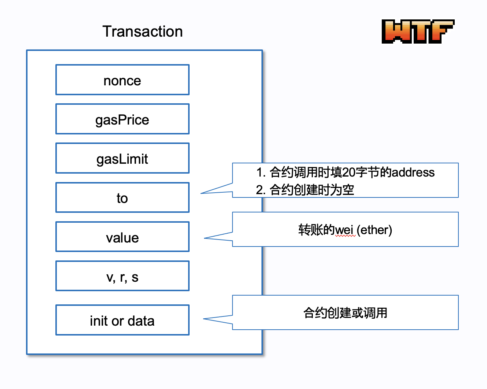
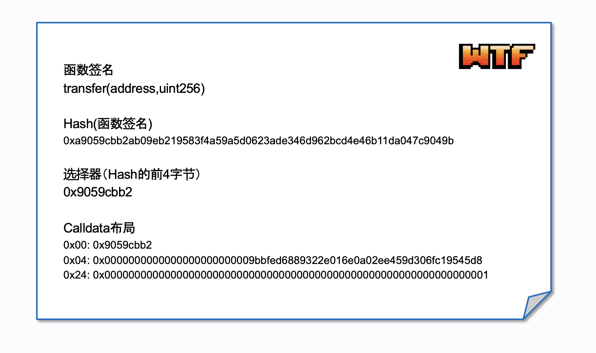

# WTF Opcodes极简入门: 14. 交易指令

我最近在重新学以太坊opcodes，也写一个“WTF EVM Opcodes极简入门”，供小白们使用。

推特：[@0xAA_Science](https://twitter.com/0xAA_Science)

社区：[Discord](https://discord.gg/5akcruXrsk)｜[微信群](https://docs.google.com/forms/d/e/1FAIpQLSe4KGT8Sh6sJ7hedQRuIYirOoZK_85miz3dw7vA1-YjodgJ-A/viewform?usp=sf_link)｜[官网 wtf.academy](https://wtf.academy)

所有代码和教程开源在github: [github.com/WTFAcademy/WTF-Opcodes](https://github.com/WTFAcademy/WTF-Opcodes)

-----

在这一讲，我们将探索EVM中与交易（Transaction）上下文相关的4个指令，包括`ADDRESS`, `ORIGIN`, `CALLER`等。我们能利用这些指令访问当前交易或调用者的信息。


## 交易的基本结构



在深入学习这些指令之前，让我们先了解以太坊交易的基本结构。每一笔以太坊交易都包含以下属性：

- `nonce`：一个与发送者账户相关的数字，表示该账户已发送的交易数。
- `gasPrice`：交易发送者愿意支付的单位gas价格。
- `gasLimit`：交易发送者为这次交易分配的最大gas数量。
- `to`：交易的接收者地址。当交易为合约创建时，这一字段为空。
- `value`：以wei为单位的发送金额。
- `data`：附带的数据，通常为合约调用的输入数据（calldata）或新合约的初始化代码（initcode）。
    
- `v, r, s`：与交易签名相关的三个值。

在此基础上，我们可以在极简EVM中添加一个交易类，除了上述的信息以外，我们还把一些交易上下文分信息包含其中，包含当前调用者`caller`，原始发送者`origin`（签名者），和执行合约地址，`thisAddr`（Solidity中的`address(this)`）:

```python
class Transaction:
    def __init__(self, to = '', value = 0, data = '', caller='0x00', origin='0x00', thisAddr='0x00', gasPrice=1, gasLimit=21000, nonce=0, v=0, r=0, s=0):
        self.nonce = nonce
        self.gasPrice = gasPrice
        self.gasLimit = gasLimit
        self.to = to
        self.value = value
        self.data = data
        self.caller = caller
        self.origin = origin
        self.thisAddr = thisAddr
        self.v = v
        self.r = r
        self.s = s
```

当初始化evm对象时，需要传入`Transaction`对象:

```python
class EVM:
    def __init__(self, code, txn = None):

        # 初始化其他变量...

        self.txn = txn

# 示例
code = b"\x73\x9b\xbf\xed\x68\x89\x32\x2e\x01\x6e\x0a\x02\xee\x45\x9d\x30\x6f\xc1\x95\x45\xd8\x31"
txn = Transaction(to='0x9bbfed6889322e016e0a02ee459d306fc19545d8', value=10, data='', caller='0xd8dA6BF26964aF9D7eEd9e03E53415D37aA96045', origin='0xd8dA6BF26964aF9D7eEd9e03E53415D37aA96045')
vm = EVM(code, txn)
```

## 交易指令

### 1. ADDRESS

- 操作码：`0x30`
- gas消耗: 2
- 功能：将当前执行合约的地址压入堆栈。
- 使用场景：当合约需要知道自己的地址时使用。

```python
def address(self):
    self.stack.append(self.txn.thisAddr)
```

### 2. ORIGIN

- 操作码：`0x32`
- gas消耗: 2
- 功能：将交易的原始发送者（即签名者）地址压入堆栈。
- 使用场景：区分合约调用者与交易发起者。

```python
def origin(self):
    self.stack.append(self.txn.origin)
```

### 3. CALLER

- 操作码：`0x33`
- gas消耗: 2
- 功能：将直接调用当前合约的地址压入堆栈。
- 使用场景：当合约需要知道是谁调用了它时使用。

```python
def caller(self):
    self.stack.append(self.txn.caller)
```

### 4. CALLVALUE

- 操作码：`0x34`
- gas消耗: 2
- 功能：将发送给合约的ether的数量（以wei为单位）压入堆栈。
- 使用场景：当合约需要知道有多少以太币被发送时使用。

```python
def callvalue(self):
    self.stack.append(self.txn.value)
```

### 5. CALLDATALOAD

- 操作码：`0x35`
- gas消耗: 3
- 功能：从交易或合约调用的`data`字段加载数据。它从堆栈中弹出calldata的偏移量（`offset`），然后从calldata的`offset`位置读取32字节的数据并压入堆栈。如果calldata剩余不足32字节，则补0。
- 使用场景：读取传入的数据。

```python
def calldataload(self):
    if len(self.stack) < 1:
        raise Exception('Stack underflow')
    offset = self.stack.pop()
    # 从字符形式转换为bytes数组
    calldata_bytes = bytes.fromhex(self.txn.data[2:])  # 假设由 '0x' 开头
    data = bytearray(32)
    # 复制calldata
    for i in range(32):
        if offset + i < len(calldata_bytes):
            data[i] = calldata_bytes[offset + i]
    self.stack.append(int.from_bytes(data, 'big'))
```

### 6. CALLDATASIZE

- 操作码：`0x36`
- gas消耗：2
- 功能：获取交易或合约调用的`data`字段的字节长度，并压入堆栈。
- 使用场景：在读取数据之前检查大小。

```python
def calldatasize(self):
    # Assuming calldata is a hex string with a '0x' prefix
    size = (len(self.transaction.data) - 2) // 2
    self.stack.append(size)
```

### 7. CALLDATACOPY

- 操作码：`0x37`
- gas消耗：3 + 3 * 数据长度 + 内存扩展成本
- 功能：将`data`中的数据复制到内存中。它会从堆栈中弹出3个参数(mem_offset, calldata_offset, length)，分别对应写到内存的偏移量，读取calldata的偏移量和长度。
- 使用场景：将输入数据复制到内存。

```python
def calldatacopy(self):
    # 确保堆栈中有足够的数据
    if len(self.stack) < 3:
        raise Exception('Stack underflow')
    mem_offset = self.stack.pop()
    calldata_offset = self.stack.pop()
    length = self.stack.pop()
        
    # 拓展内存
    if len(self.memory) < mem_offset + length:
        self.memory.extend([0] * (mem_offset + length - len(self.memory)))

    # 从字符形式转换为bytes数组.
    calldata_bytes = bytes.fromhex(self.txn.data[2:])  # Assuming it's prefixed with '0x'

    # 将calldata复制到内存
    for i in range(length):
        if calldata_offset + i < len(calldata_bytes):
            self.memory[mem_offset + i] = calldata_bytes[calldata_offset + i]
```

### 8. CODESIZE

- 操作码：`0x38`
- gas消耗： 2
- 功能：获取当前合约代码的字节长度，然后压入堆栈。
- 使用场景：当合约需要访问自己的字节码时使用。

```python
def codesize(self):
    addr = self.txn.thisAddr
    self.stack.append(len(account_db.get(addr, {}).get('code', b'')))
```

### 9. CODECOPY

- 操作码：`0x39`
- gas消耗：3 + 3 * 数据长度 + 内存扩展成本
- 功能：复制合约的代码到EVM的内存中。它从堆栈中弹出三个参数：目标内存的开始偏移量（`mem_offset`）、代码的开始偏移量（`code_offset`）、以及要复制的长度（`length`）。
- 使用场景：当合约需要读取自己的部分字节码时使用。

```python
def codecopy(self):
    if len(self.stack) < 3:
        raise Exception('Stack underflow')

    mem_offset = self.stack.pop()
    code_offset = self.stack.pop()
    length = self.stack.pop()

    # 获取当前地址的code
    addr = self.txn.thisAddr
    code = account_db.get(addr, {}).get('code', b'')

    # 拓展内存
    if len(self.memory) < mem_offset + length:
        self.memory.extend([0] * (mem_offset + length - len(self.memory)))

    # 将代码复制到内存
    for i in range(length):
        if code_offset + i < len(code):
            self.memory[mem_offset + i] = code[code_offset + i]
```

### 10. GASPRICE

- 操作码：`0x3A`
- gas消耗：2
- 功能：获取交易的gas价格，并压入堆栈。
- 使用场景：当合约需要知道当前交易的gas价格时使用。

```python
def gasprice(self):
    self.stack.append(self.txn.gasPrice)
```

## 总结

在这一讲，我们详细介绍了EVM中与交易有关的10个指令。这些指令为智能合约提供了与其环境交互的能力，使其能够访问调用者，calldata，和代码等信息。目前，我们已经学习了144个操作码中的126个！