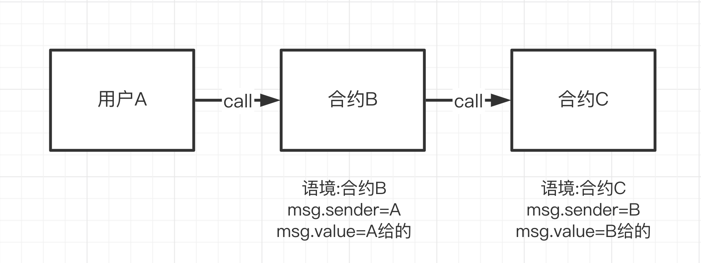

# WTF Opcodes极简入门: 18. Call指令

我最近在重新学以太坊opcodes，也写一个“WTF EVM Opcodes极简入门”，供小白们使用。

推特：[@0xAA_Science](https://twitter.com/0xAA_Science)

社区：[Discord](https://discord.gg/5akcruXrsk)｜[微信群](https://docs.google.com/forms/d/e/1FAIpQLSe4KGT8Sh6sJ7hedQRuIYirOoZK_85miz3dw7vA1-YjodgJ-A/viewform?usp=sf_link)｜[官网 wtf.academy](https://wtf.academy)

所有代码和教程开源在github: [github.com/WTFAcademy/WTF-Opcodes](https://github.com/WTFAcademy/WTF-Opcodes)

-----

这一讲，我们介绍EVM中的`CALL`指令。`CALL`指令可以被视为以太坊的核心，它允许合约之间进行交互，让区块链上的合约不再孤立。如果你不了解`CALL`指令，请参考[WTF Solidity教程第22讲](https://github.com/AmazingAng/WTF-Solidity/blob/main/22_Call/readme.md)。



## CALL 指令

`CALL`指令会创建一个子环境来执行其他合约的部分代码，发送`ETH`，并返回数据。返回数据可以使用`RETURNDATASIZE`和`RETURNDATACOPY`获取。若执行成功，会将`1`压入堆栈；否则，则压入`0`。如果目标合约没有代码，仍将`1`压入堆栈（视为成功）。如果账户`ETH`余额小于要发送的`ETH`数量，调用失败，但当前交易不会回滚。

它从堆栈中弹出7个参数，依次为：

- `gas`：为这次调用分配的gas量。
- `to`：被调用合约的地址。
- `value`：要发送的以太币数量，单位为`wei`。
- `mem_in_start`：输入数据（calldata）在内存的起始位置。
- `mem_in_size`：输入数据的长度。
- `mem_out_start`：返回数据（returnData）在内存的起始位置。
- `mem_out_size`：返回数据的长度。

它的操作码为`0xF1`，gas消耗比较复杂，包含内存扩展和代码执行等成本。

下面，我们在极简EVM中支持`CALL`指令。由于`CALL`指令比较复杂，我们进行了一些简化，主要包括以下几个步骤：读取calldata，更新ETH余额，根据目标地址代码创建evm子环境，执行evm子环境代码，读取返回值。

```python
def call(self):
    if len(self.stack) < 7:
        raise Exception('Stack underflow')
        
    gas = self.stack.pop()
    to_addr = self.stack.pop()
    value = self.stack.pop()
    mem_in_start = self.stack.pop()
    mem_in_size = self.stack.pop()
    mem_out_start = self.stack.pop()
    mem_out_size = self.stack.pop()
    
    # 拓展内存
    if len(self.memory) < mem_in_start + mem_in_size:
        self.memory.extend([0] * (mem_in_start + mem_in_size - len(self.memory)))

    # 从内存中获取输入数据
    data = self.memory[mem_in_start: mem_in_start + mem_in_size]

    account_source = account_db[self.txn.caller]
    account_target = account_db[hex(to_addr)]
    
    # 检查caller的余额
    if account_source['balance'] < value:
        self.success = False
        print("Insufficient balance for the transaction!")
        self.stack.append(0) 
        return
    
    # 更新余额
    account_source['balance'] -= value
    account_target['balance'] += value
    
    # 使用txn构建上下文
    ctx = Transaction(to=hex(to_addr), 
                        data=data,
                        value=value,
                        caller=self.txn.thisAddr, 
                        origin=self.txn.origin, 
                        thisAddr=hex(to_addr), 
                        gasPrice=self.txn.gasPrice, 
                        gasLimit=self.txn.gasLimit, 
                        )
    
    # 创建evm子环境
    evm_call = EVM(account_target['code'], ctx)
    evm_call.run()
    
    # 拓展内存
    if len(self.memory) < mem_out_start + mem_out_size:
        self.memory.extend([0] * (mem_out_start + mem_out_size - len(self.memory)))
    
    self.memory[mem_out_start: mem_out_start + mem_out_size] = evm_call.returnData
    
    if evm_call.success:
        self.stack.append(1)  
    else:
        self.stack.append(0)  
```

## 测试

测试用的以太坊账户状态：
```python
account_db = {
    '0x9bbfed6889322e016e0a02ee459d306fc19545d8': {
        'balance': 100, # wei
        'nonce': 1, 
        'storage': {},
        'code': b''
    },
    '0x1000000000000000000000000000000000000c42': {
        'balance': 0, # wei
        'nonce': 0, 
        'storage': {},
        'code': b'\x60\x42\x60\x00\x52\x60\x01\x60\x1f\xf3'  # PUSH1 0x42 PUSH1 0 MSTORE PUSH1 1 PUSH1 31 RETURN
    },

    # ... 其他账户数据 ...
}
```

在测试中，我们会使用第一个地址（`0x9bbf`起始）调用第二个地址（`0x1000`起始），运行上面的代码（`PUSH1 0x42 PUSH1 0 MSTORE PUSH1 1 PUSH1 31 RETURN`），成功的话会返回`0x42`。

测试字节码为`6001601f5f5f6001731000000000000000000000000000000000000c425ff15f51`（PUSH1 1 PUSH1 31 PUSH0  PUSH0 PUSH1 1 PUSH20 1000000000000000000000000000000000000c42 PUSH0 CALL PUSH0 MLOAD），它会调用第二个地址上的代码，并发送`1 wei`的以太坊，然后将内存中的返回值`0x42`压入堆栈。

```python
# Call
code = b"\x60\x01\x60\x1f\x5f\x5f\x60\x01\x73\x10\x00\x00\x00\x00\x00\x00\x00\x00\x00\x00\x00\x00\x00\x00\x00\x00\x00\x0c\x42\x5f\xf1\x5f\x51"
evm = EVM(code, txn)
evm.run()
print(hex(evm.stack[-2]))
# output: 0x1 (success)
print(hex(evm.stack[-1]))
# output: 0x42
```

## 总结

这一讲，我们探讨了`CALL`指令，它使得EVM上的合约可以调用其他合约，实现更复杂的功能。希望这一讲对您有所帮助！目前，我们已经学习了144个操作码中的137个（95%）！
