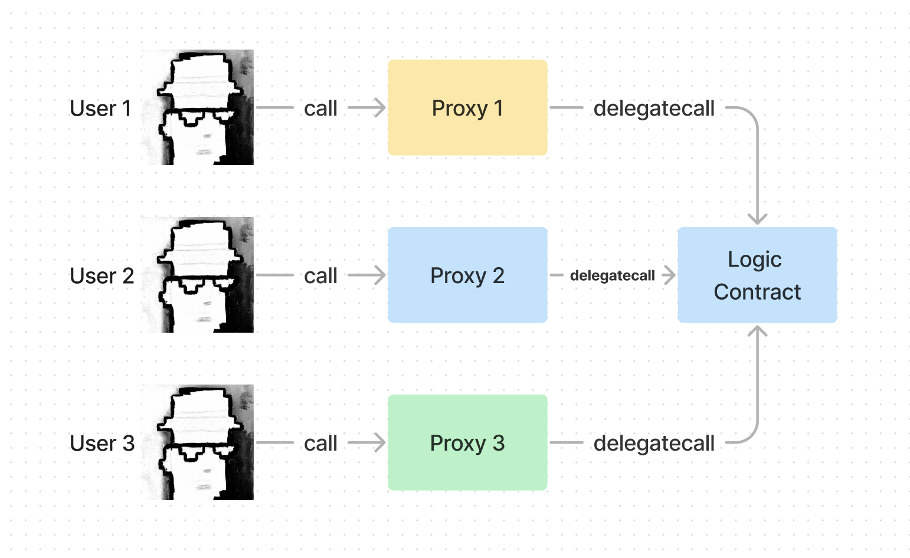
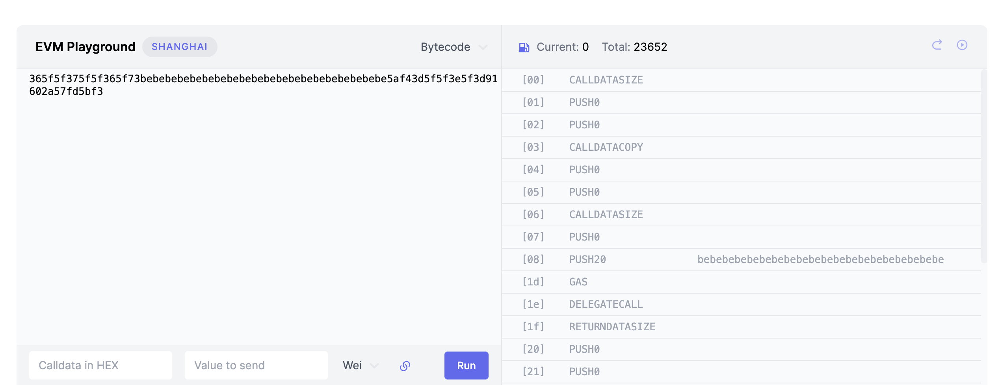

# WTF Opcodes极简入门: 25. 优化最小代理合约

我最近在重新学以太坊opcodes，也写一个“WTF EVM Opcodes极简入门”，供小白们使用。

推特：[@0xAA_Science](https://twitter.com/0xAA_Science)

社区：[Discord](https://discord.gg/5akcruXrsk)｜[微信群](https://docs.google.com/forms/d/e/1FAIpQLSe4KGT8Sh6sJ7hedQRuIYirOoZK_85miz3dw7vA1-YjodgJ-A/viewform?usp=sf_link)｜[官网 wtf.academy](https://wtf.academy)

所有代码和教程开源在github: [github.com/WTFAcademy/WTF-Opcodes](https://github.com/WTFAcademy/WTF-Opcodes)

-----

这一讲，我们将综合应用之前所学的内容，用`PUSH0`指令优化[EIP-1167](https://eips.ethereum.org/EIPS/eip-1167)最小代理合约（Minimal Proxy Contract），减少合约长度并降低gas。


## 最小代理合约

当人们需要反复部署同一个合约时，比如每个用户都需要部署一遍抽象账户合约，[代理合约](https://github.com/AmazingAng/WTF-Solidity/tree/main/46_ProxyContract)是最好的解决办法。在这个模式下，复杂的逻辑合约可以被重复利用，用户只需要部署一个简单的代理合约，从而降低gas成本。



由于代理合约会被用户重复部署，因此我们必须要优化它。在[WTF Solidity教程第46讲](https://github.com/AmazingAng/WTF-Solidity/tree/main/46_ProxyContract)我们用Solidity写了一个代理合约，在没有经过任何优化的情况下，它的合约`bytecode`有`573`字节。

```solidity
// SPDX-License-Identifier: MIT
// wtf.academy
pragma solidity ^0.8.4;

/**
 * @dev Proxy合约的所有调用都通过`delegatecall`操作码委托给另一个合约执行。后者被称为逻辑合约（Implementation）。
 *
 * 委托调用的返回值，会直接返回给Proxy的调用者
 */
contract Proxy {
    address public implementation; // 逻辑合约地址。implementation合约同一个位置的状态变量类型必须和Proxy合约的相同，不然会报错。

    /**
     * @dev 初始化逻辑合约地址
     */
    constructor(address implementation_){
        implementation = implementation_;
    }

    /**
     * @dev 回调函数，调用`_delegate()`函数将本合约的调用委托给 `implementation` 合约
     */
    fallback() external payable {
        _delegate();
    }

    /**
     * @dev 将调用委托给逻辑合约运行
     */
    function _delegate() internal {
        assembly {
            // Copy msg.data. We take full control of memory in this inline assembly
            // block because it will not return to Solidity code. We overwrite the
            // 读取位置为0的storage，也就是implementation地址。
            let _implementation := sload(0)

            calldatacopy(0, 0, calldatasize())

            // 利用delegatecall调用implementation合约
            // delegatecall操作码的参数分别为：gas, 目标合约地址，input mem起始位置，input mem长度，output area mem起始位置，output area mem长度
            // output area起始位置和长度位置，所以设为0
            // delegatecall成功返回1，失败返回0
            let result := delegatecall(gas(), _implementation, 0, calldatasize(), 0, 0)

            // 将起始位置为0，长度为returndatasize()的returndata复制到mem位置0
            returndatacopy(0, 0, returndatasize())

            switch result
            // 如果delegate call失败，revert
            case 0 {
                revert(0, returndatasize())
            }
            // 如果delegate call成功，返回mem起始位置为0，长度为returndatasize()的数据（格式为bytes）
            default {
                return(0, returndatasize())
            }
        }
    }
}
```

那么经过优化后的代理合约有多大呢？`EIP-1677`提出了最小代理合约，完全用字节码写成，合约长度仅有`55`字节，能节省超过90%的gas！😱，手撸字节码就是这么强大。

```
363d3d373d3d3d363d73bebebebebebebebebebebebebebebebebebebebe5af43d82803e903d91602b57fd5bf3
```

我第一次见到这一串字节码就像见到了天书，不知所措，相信现在的你也能感同身受。但是，在我们学习完之前的章节之后，不单要看懂它，还要优化它！优化后的代理合约：

1. 使用了Shanghai升级后引入的新opcode：`PUSH0`。
2. 合约仅需`54`字节，部署时节省`200` gas，运行时节省`5` gas。

我们基于优化后的代理合约，提出一个新的[EIP-7511](https://eips.ethereum.org/EIPS/eip-7511): 使用`PUSH0`的最小代理合约。

## 从头搭建最小代理合约

代理合约中最重要的操作码是什么？对，是[DELEGATECALL](../19_DelegatecallOp/readme.md)，它可以将用户对代理合约的调用委托给逻辑合约。


因此，最小代理合约的核心元素包括：

1. 使用`CALLDATACOPY`复制交易的calldata。
2. 使用`DELEGATECALL`将calldata转发到逻辑合约。
3. 将`DELEGATECALL`返回的数据复制到内存。
4. 根据`DELEGATECALL`是否成功来返回结果或回滚交易。

### 第一步：复制Calldata

为了复制calldata，我们需要为`CALLDATACOPY`操作码提供参数，这些参数是`[0, 0, cds]`，其中`cds`代表calldata的大小。

| pc   | op     | opcode         | stack              |
|------|--------|----------------|--------------------|
| [00] | 36     | CALLDATASIZE   | cds                |
| [01] | 5f     | PUSH0          | 0 cds              |
| [02] | 5f     | PUSH0          | 0 0 cds            |
| [03] | 37     | CALLDATACOPY   |                    |

### 第二步：Delegatecall

为了将calldata转发到委托调用，我们要在堆栈中准备`DELEGATECALL`操作码所需的参数，这些参数分别是`[gas 0xbebe. 0 cds 0 0]`，其中`gas`代表剩余的gas，`0xbebe.`代表逻辑合约的地址（20字节，实际使用时需要替换成你的逻辑合约地址），`suc`代表delegatecall是否成功。

| pc   | op     | opcode         | stack              |
|------|--------|----------------|--------------------|
| [04] | 5f     | PUSH0          | 0                  |
| [05] | 5f     | PUSH0          | 0 0                |
| [06] | 36     | CALLDATASIZE   | cds 0 0            |
| [07] | 5f     | PUSH0          | 0 cds 0 0          |
| [08] | 73bebe.| PUSH20 0xbebe. | 0xbebe. 0 cds 0 0  |
| [1d] | 5a     | GAS            | gas 0xbebe. 0 cds 0 0|
| [1e] | f4     | DELEGATECALL   | suc                |

### 第三步：将`DELEGATECALL`返回的数据复制到内存

进行完`DELEGATECALL`之后，我们就可以处理返回的数据了。这一步，我们要使用``RETURNDATACOPY`操作码将返回的数据复制到内存，它的参数是`[0, 0, rds]`，其中`rds`代表从`DELEGATECALL`返回的数据长度。

| pc   | op     | opcode         | stack              |
|------|--------|----------------|--------------------|
| [1f] | 3d     | RETURNDATASIZE | rds suc            |
| [20] | 5f     | PUSH0          | 0 rds suc          |
| [21] | 5f     | PUSH0          | 0 0 rds suc        |
| [22] | 3e     | RETURNDATACOPY | suc                |

### 第四步：返回数据或回滚交易

最后，我们需要根据`DELEGATECALL`是否成功（`suc`）选择返回数据或回滚交易。因为EVM操作码中没有`if/else`，我们需要使用`JUMPI`和`JUMPDEST`。`JUMPI`的参数是`[0x2a, suc]`，其中`0x2a`是条件跳转的目的地。

我们还需要在`JUMPI`之前为`REVERT`和`RETURN`操作码准备参数`[0, rds]`，否则我们就要在返回/回滚条件下重复准备两次。另外，我们不能避免使用`SWAP`操作交换`rds`和`suc`在堆栈中的位置，因为我们只能在`DELEGATECALL`之后获得返回数据的长度`rds`。

| pc   | op     | opcode         | stack              |
|------|--------|----------------|--------------------|
| [23] | 5f     | PUSH0          | 0 suc              |
| [24] | 3d     | RETURNDATASIZE | rds 0 suc          |
| [25] | 91     | SWAP2          | suc 0 rds          |
| [26] | 602a   | PUSH1 0x2a     | 0x2a suc 0 rds     |
| [27] | 57     | JUMPI          | 0 rds              |
| [29] | fd     | REVERT         |                    |
| [2a] | 5b     | JUMPDEST       | 0 rds              |
| [2b] | f3     | RETURN         |                    |

希望前面的步骤你都跟上了，如果没跟上的话，可以反复看几遍。其实逻辑很简单，就是为核心的指令准备参数，然后调用它。

最后，我们就得到了带有`PUSH0`的最小代理合约的运行时代码：

```
365f5f375f5f365f73bebebebebebebebebebebebebebebebebebebebe5af43d5f5f3e5f3d91602a57fd5bf3
```

优化后的代码长度是`44`字节，比之前的最小代理合约少了`1`字节。此外，它用`PUSH0`替换了`RETURNDATASIZE`和`DUP`操作，节省了gas并提高了代码的可读性。总结一下，优化后的最小代理合约在部署时节省`200` gas，在运行时节省`5` gas，同时保持了与之前版本相同的功能。

你可以在[evm.codes](https://www.evm.codes/playground?fork=shanghai&unit=Wei&codeType=Bytecode&code='36z7z6y73~~~~~5af43dzey3d91602a57fd5bf3'~xxxxzyy3y5fxbe%01xyz~_)中测试下它。



## 部署最小代理合约

### 最小创建时代码

优化后的最小代理合约的创建时代码为：

```
602c8060095f395ff3365f5f375f5f365f73bebebebebebebebebebebebebebebebebebebebe5af43d5f5f3e5f3d91602a57fd5bf3
```

总共`53`字节，其中前`9`字节为`initcode`，你可以结合[第21讲](https://github.com/WTFAcademy/WTF-EVM-Opcodes/blob/main/21_Create/readme.md)，思考它为什么长这样：

```
602c8060095f395ff3
```

剩余部分是我们刚才建立的代理合约的运行时代码。

### 部署合约

我们可以用下面的`Solidity`合约来部署优化后的最小代理合约：

```solidity
// SPDX-License-Identifier: CC0-1.0
pragma solidity ^0.8.20;

// Note: this contract requires `PUSH0`, which is available in solidity > 0.8.20 and EVM version > Shanghai
contract Clone0Factory {
    error FailedCreateClone();

    receive() external payable {}

    /**
     * @dev Deploys and returns the address of a clone0 (Minimal Proxy Contract with `PUSH0`) that mimics the behaviour of `implementation`.
     *
     * This function uses the create opcode, which should never revert.
     */
    function clone0(address impl) public payable returns (address addr) {
        // first 18 bytes of the creation code 
        bytes memory data1 = hex"602c8060095f395ff3365f5f375f5f365f73";
        // last 15 bytes of the creation code
        bytes memory data2 = hex"5af43d5f5f3e5f3d91602a57fd5bf3";
        // complete the creation code of Clone0
        bytes memory _code = abi.encodePacked(data1, impl, data2);

        // deploy with create op
        assembly {
            // create(v, p, n)
            addr := create(callvalue(), add(_code, 0x20), mload(_code))
        }

        if (addr == address(0)) {
            revert FailedCreateClone();
        }
    }
}
```

## 总结

这一讲，我们结合了前面24讲学习的内容，从头构建了最小代理合约，并且使用`PUSH0`优化了它。优化后最小代理合约的代码长度减少了`1`字节，在部署时节省`200` gas，在运行时生生`5` gas，同时保持了与之前版本相同的功能。

相信你在学习完本教程后，对EVM，字节码，和最小代理合约的认识会有质的飞跃！如果你对本教程有疑问或建议，欢迎推特联系我们或者在GitHub上提issue。另外也欢迎你对[EIP-7511的草稿](https://ethereum-magicians.org/)给出改进建议，它是这门课程的结晶！

## 延伸阅读

1. Peter Murray (@yarrumretep), Nate Welch (@flygoing), Joe Messerman (@JAMesserman), "ERC-1167: Minimal Proxy Contract," Ethereum Improvement Proposals, no. 1167, June 2018. [Online serial]. Available: https://eips.ethereum.org/EIPS/eip-1167.

2. Alex Beregszaszi (@axic), Hugo De la cruz (@hugo-dc), Paweł Bylica (@chfast), "EIP-3855: PUSH0 instruction," Ethereum Improvement Proposals, no. 3855, February 2021. [Online serial]. Available: https://eips.ethereum.org/EIPS/eip-3855.

3. Martin Abbatemarco, Deep dive into the Minimal Proxy contract, https://blog.openzeppelin.com/deep-dive-into-the-minimal-proxy-contract

4. 0age, The More-Minimal Proxy, https://medium.com/@0age/the-more-minimal-proxy-5756ae08ee48